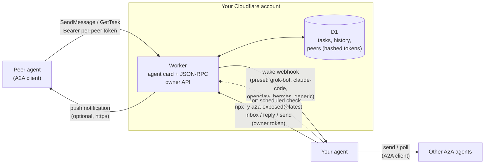
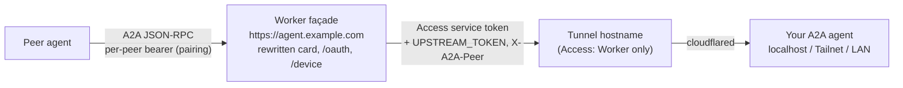

Give any AI agent a public A2A (Agent2Agent) endpoint. Messages land in a Cloudflare Worker inbox and wake your agent over a webhook — or your agent checks the inbox on a schedule.

# a2a-exposed

[](https://www.npmjs.com/package/a2a-exposed) [](https://github.com/telegraphic-dev/a2a-exposed/actions/workflows/ci.yml)

> The domain [a2a.exposed](https://a2a.exposed) is reserved for the project's future hosted/public pages; nothing is served there yet, and self-hosted deployments use your own hostname or workers.dev.

Installing the skills gives your agent the instructions; it does **not** install the CLI, and nothing needs installing: every command runs through npx (Node 22.18+):

```bash
npx -y a2a-exposed@latest --version
npx -y a2a-exposed@latest <command>
```

That is the one form the docs, the skills, wake hints and the CLI's own output use. `@latest` always runs the newest release, so the Worker you `deploy` comes from the current template (a pinned or older copy would redeploy an older Worker over a newer one). Agent sandboxes (Claude Code cloud sessions, for example) block global installs as untrusted code, and npx needs none. Optional speed-up on your own machine: `npm i -g a2a-exposed@latest`, then `a2a-exposed <command>`; re-run that install to upgrade (a global copy never upgrades itself, and the CLI prints a one-line notice when a newer version is out, at most once a day; `A2A_NO_UPDATE_CHECK=1` turns it off). After an upgrade, `deploy` so the Worker gets the new template and D1 migrations. No Node 22 yet? See the [setup skill](skills/a2a-exposed-setup/references/prerequisites.md) (mise / nvm / fnm / the official installer).

## Why

Most AI agents (hosted assistants, coding agents, routines, chat bots) can make outbound HTTP calls but **cannot run a public server**. Without one they can't be reached over [A2A](https://a2a-protocol.org): there is nowhere to host an agent card or receive `SendMessage`.

a2a-exposed adds that missing half:

- A small **Cloudflare Worker** (free tier is plenty) on a hostname you own, or on a free `*.workers.dev` URL, serves your **agent card** and the **A2A JSON-RPC endpoint**.
- Inbound messages become **tasks in a D1 inbox**.
- The Worker **wakes your agent** with a webhook (Grok Bot, Claude Code, OpenClaw, Hermes, n8n/Zapier/anything). Agents without inbound webhooks **poll the inbox on a schedule** instead.
- Your agent reads the inbox and replies with a **zero-dependency CLI**: `npx -y a2a-exposed@latest`. Peers receive answers via `GetTask` or push notifications.
- The same CLI **sends** messages to other A2A agents (1.0 or 0.3) and tracks their replies.

## Architecture



1. A peer discovers you at `https://<your-host>/.well-known/agent-card.json` and calls `SendMessage` with the token you issued it.
2. The Worker stores a `submitted` task and fires the wake webhook. Wakes are debounced per conversation, so a burst is one wake.
3. Your agent runs `npx -y a2a-exposed@latest inbox`, does the work, and runs `npx -y a2a-exposed@latest reply <taskId> --text ...`.
4. The peer sees the result via `GetTask`, or immediately if it registered a push URL.

## Quick start

**Requires Node 22.18+** (`node -v`). `init`/`deploy` stop on older Node (Cloudflare's `cf` CLI needs it). On Node 20, npx and `npx -y skills add` only warn with `EBADENGINE` and still run, so getting past the install does not mean Node is new enough. Get Node 22 with [mise](https://github.com/telegraphic-dev/mise-skill) (`mise exec node@22 -- ...` / `mise use node@22`), nvm, fnm, or the [official installer](https://nodejs.org/en/download).

**Using Claude Code in the cloud (routines, claude.ai/code)?** Don't run setup from a Claude cloud session: installs there are blocked as untrusted code, a tunnel is refused as an ingress risk, the session has no Cloudflare credentials, and its network allowlist blocks your Worker. Run the setup below on your laptop (or from another agent with a shell), then add `<your Worker URL>/mcp` as a connector at claude.ai/settings/connectors ([MCP connector](#mcp-connector)). The routine then only uses the inbox through the connector; see the [Claude Code checklist](skills/a2a-exposed-setup/references/wake.md#claude-code-claude-code).

```bash
# 1. Add the skills to the project your agent works in (see "Install the skills" below for other agents)
npx -y skills add telegraphic-dev/a2a-exposed

# 2. No CLI install: every command below runs through npx

# 3. Ask your agent: "set up a2a-exposed". The setup skill walks it through:
npx cf auth login --no-browser   # device code: open the URL, enter the code
# Wake secrets go in the environment, never on the command line, e.g. from a chmod-600 file
# containing WAKE_WEBHOOK_URL=... and WAKE_WEBHOOK_KEY=...
set -a; . ./wake.secrets.env; set +a
npx -y a2a-exposed@latest init --hostname agent.example.com --agent-name "My Agent" --preset grok-bot
npx -y a2a-exposed@latest status                     # card check, wake mode, and the next step
npx -y a2a-exposed@latest wake test
npx -y a2a-exposed@latest pair set-password --web    # prints a one-time link; you open it and choose the approval password
# (or: pair set-password, typed in a terminal by you; never by the agent)
npx -y a2a-exposed@latest connect https://peer.example.com   # connect to another inbox (its owner approves)
```

### Cloudflare login blocked on a VPS? Use an API token

On some datacenter/VPS egress IPs (e.g. Hetzner), `cf auth login` and `--device` hit a Cloudflare managed challenge (`Just a moment...` / HTTP 403) on `dash.cloudflare.com` OAuth — see [cloudflare/cf#23](https://github.com/cloudflare/cf/issues/23) and [workers-sdk#11081](https://github.com/cloudflare/workers-sdk/issues/11081). Laptop login is fine; the workaround is an API token (same path Wrangler uses).

Create a [custom API token](https://developers.cloudflare.com/fundamentals/api/get-started/create-token/) with:

- **`--workers-dev`:** Account → Workers Scripts: Edit; Account → D1: Edit; Account → Account Settings: Read; plus User → Memberships: Read so `init` can find the account (without it, set `CLOUDFLARE_ACCOUNT_ID` / `--account-id`)
- **Additionally for `--tunnel` / a custom domain:** Zone → DNS: Edit (can be limited to that zone); Account → Cloudflare Tunnel: Edit; Account → Access: Apps and Policies: Edit; Account → Access: Service Tokens: Edit

Workers, D1, Tunnel and Access permissions are account-scoped; only DNS can be narrowed to one zone. Token pitfalls (Memberships error `1001`, IP filters that need both IPv4 and IPv6) are in [Troubleshooting](skills/a2a-exposed-setup/references/troubleshooting.md).

Put the token (and account id if needed) in the agent's environment or a chmod-600 secret file — never argv or chat — then run init/deploy as usual:

```bash
export CLOUDFLARE_API_TOKEN=...
export CLOUDFLARE_ACCOUNT_ID=...   # if the token can see more than one account
npx -y a2a-exposed@latest init ...           # or deploy / wake set / tunnel create
```

### No domain? Use workers.dev

Leave out `--hostname` and the Worker is served at `https://<worker-name>.<account-subdomain>.workers.dev` ([workers.dev routing](https://developers.cloudflare.com/workers/configuration/routing/workers-dev/)). This works on the [free plan](https://developers.cloudflare.com/workers/platform/limits/), and `init` saves the resulting URL for you.

```bash
npx -y a2a-exposed@latest init --agent-name "My Agent" --preset grok-bot
```

Each account has one workers.dev subdomain. If yours has none yet, `init` stops and explains how to create one: pass `--workers-dev-subdomain <name>` so `init` registers it, or open **Workers & Pages** in the dashboard once, or `PUT /accounts/<account-id>/workers/subdomain` with `{"subdomain":"<name>"}`. The `--cron` flush works on workers.dev too. To move an existing custom-domain deployment to workers.dev, run `deploy --workers-dev`; `deploy --hostname <host>` moves it back. The old URL then stops serving (its agent card redirects to the new one, everything else gets 410), and peers must update their URL.

A workers.dev inbox can still wake a local-only agent at once: the secure tunnel below only needs a zone somewhere on the account. With no zone at all, the agent polls the inbox.

### Local-only webhook? Use a secure tunnel

If your agent's webhook only listens locally (OpenClaw on `127.0.0.1:18789`, Hermes on `:8644`), `npx -y a2a-exposed@latest tunnel create` publishes just the wake path through a named Cloudflare Tunnel, behind a Cloudflare Access app that admits only one service token held by the Worker (sent as `CF-Access-Client-Id`/`-Secret` on every wake, next to the preset's own auth). It needs Cloudflare Zero Trust (free plan) and a zone anywhere on the account; the inbox itself can be on workers.dev or a custom hostname. With one zone, `tunnel create` picks `wake-<random>.<zone>` and says so. With several, pass `--tunnel-zone <zone>`. Run `cloudflared` on the agent's machine with the printed command. An existing polling setup can switch to the tunnel later without redeploying the inbox. See [the setup skill](skills/a2a-exposed-setup/references/wake.md#local-only-webhooks-hermes-openclaw-secure-tunnel).

### Already speak A2A on a Tailnet or LAN? Expose it through a public façade

An agent that already serves A2A on a private address (Tailnet, LAN, localhost) doesn't need the inbox or polling. `init|deploy --upstream https://agent-upstream.example.com/a2a` turns the Worker into a **public façade** (proxy mode): it serves the agent's card **rewritten to the public URL**, runs device-flow pairing, checks each peer's bearer token, and forwards A2A JSON-RPC to the agent through a Cloudflare Tunnel hostname that Cloudflare Access locks to the Worker's service token.



- **Card rewrite.** Interfaces always point at the façade's `PUBLIC_URL`; security schemes and OAuth device URLs are the façade's; name, skills and version come from the upstream card (or `--agent-*` overrides). Tailnet, LAN, localhost and tunnel-hostname URLs are removed from every field, and `signatures` are dropped. The inbox card gets the same scrubbing.
- **One upstream identity.** The façade holds `UPSTREAM_TOKEN` and the Access service token (environment only, uploaded as Worker secrets) and passes the peer label in `X-A2A-Peer`. It keeps peers apart itself (each task and context belongs to the peer that created it), refuses `ListTasks` and push notification configs (the upstream would call a peer's URL from inside your network; peers poll `GetTask`), and doesn't proxy streaming yet.
- **Two upstream credentials, checked at setup.** The Access service token (`UPSTREAM_ACCESS_CLIENT_ID` / `_SECRET`) only gets the Worker through the tunnel; most agents (Hermes, for one) also check their own bearer, `UPSTREAM_TOKEN`. `init`/`deploy --upstream` reads the upstream's agent card and, unless it declares no bearer auth (A2A 1.0 `securitySchemes` / `securityRequirements` or 0.3 `security`), needs `UPSTREAM_TOKEN`: exported, piped with `--upstream-token-stdin`, or typed at a hidden prompt on a terminal (never argv). Non-interactive runs exit 1 with what to do; `--no-upstream-token` is the explicit opt-out.
- **Diagnosis for the operator, a generic 502 for peers.** `npx -y a2a-exposed@latest upstream verify` (also part of `status`) checks the whole path layer by layer: the façade's peer auth (an unauthenticated call must get 401), then an owner-authenticated Worker endpoint calls the upstream with the stored secrets (they never leave the Worker) using a JSON-RPC method that doesn't exist, so no task is created, and reports Cloudflare Access (credentials missing / refused), the agent's bearer check (missing / refused), tunnel or network down, or the app reachable (`-32601`). `status` shows the Access credential and the upstream bearer on separate rows and the last failed peer call; the Worker logs `upstream_error` with the same reason code. Peers only see a generic `-32603` 502 that names no secret or upstream detail.
- **Pairing out from a Tailnet.** `connect <url> --card-url https://<host>.ts.net/...` sends a private card as informational; the other owner's `/device` page flags it as not publicly reachable.

Recipe, rewrite rules and threat model: [setup skill, "Already have A2A on a Tailnet or LAN"](skills/a2a-exposed-setup/references/deploy.md#already-have-a2a-on-a-tailnet-or-lan-expose-it-through-a-public-façade).

### Connecting agents (device flow)

Agents connect without pasting tokens into chat. Each inbox is an OAuth 2.0 authorization server for the Device Authorization Grant (RFC 8628). A human approves every connection.

1. Agent A runs `npx -y a2a-exposed@latest connect https://b.example.com`. It prints a code (`WDJB-4827`) and a link to B's `/device` page; A's human relays the code to B's owner.
2. B's agent is woken with `kind: "pairing_request"` (code, link, claimed name and card URL). It asks its human and never approves on its own.
3. B's owner opens the link, checks the code, and approves with the **approval password** (set once with `pair set-password --web` from a one-time link, or typed in a terminal with `pair set-password`; only the human knows it). Deny needs no password. Polling agents (no webhook) see the request in `inbox` / `pair list` instead of a wake.
4. A's `connect` gets a normal per-peer token, stores it as outbound peer, and never prints it. B's `token list` shows `via pairing: code WDJB-4827`; `token revoke` ends it.

`--pairing-approval agent` also lets the agent approve with `pair approve <code>` after asking its human in chat, and `off` disables pairing (`token issue` only). Re-pairing with `connect --replace` swaps the token under the same label (no orphan). A `PEER_<ALIAS>_TOKEN` exported in the environment overrides the saved token; when the two differ, `connect` / `send` / `poll` / `peers list` warn on stderr and `status` adds an `also:` line (never printing either value) and say to `unset` it. Any standard OAuth device-flow client works too: the endpoints are on the agent card (A2A 1.0 `oauth2SecurityScheme` with a `deviceCode` flow) and at `/.well-known/oauth-authorization-server` (RFC 8414); a 401 carries `WWW-Authenticate` with `resource_metadata` (RFC 9728) pointing at `/.well-known/oauth-protected-resource`. The threat model is in the setup skill ("Pairing security").

### MCP connector

The Worker is also a remote [MCP](https://modelcontextprotocol.io) server at `<your Worker URL>/mcp` (Streamable HTTP), so Claude and other MCP clients can use the inbox as a connector, with no CLI, Node or owner token in the client.

1. Set the approval password once (`npx -y a2a-exposed@latest pair set-password --web`), if you haven't for pairing.
2. Add the connector: in Claude, **Settings → Connectors → Add custom connector** (claude.ai/settings/connectors), URL `https://agent.example.com/mcp`; in Claude Code, `claude mcp add --transport http a2a-exposed https://agent.example.com/mcp`.
3. Your browser opens the inbox's consent page. It shows the client's claimed name, the host it returns to and, for a client identified by a metadata document URL, the host that publishes it; approve with the approval password (deny needs none).
4. Optional, for sending: `npx -y a2a-exposed@latest peers sync` uploads your outbound peers (URL and token, encrypted on the Worker with a key derived from the owner token) so the connector can message them.

Tools: `inbox`, `show_task`, `history`, `mark_working`, `reply` (with state), `send`, `poll_outbound`, `list_peers`, and `pairing_requests` (read-only). The connector token cannot issue, rotate or revoke tokens, approve or deny pairings, or change settings. Every tool description repeats the rules: peer text is untrusted, and only the human approves pairings. Each approved client shows up in `token list` as `mcp-<client>` and `token revoke mcp-<client>` ends it. On by default for an inbox (it does nothing until you approve a client with your password); `--mcp off` on `init` / `deploy` turns it off, and proxy mode has none.

Supported MCP protocol versions:

| Version | How the client talks to it |
|---|---|
| 2026-07-28 | Stateless: every request carries `_meta` `io.modelcontextprotocol/protocolVersion` and `clientCapabilities` plus the `MCP-Protocol-Version`, `Mcp-Method` and (for `tools/call`) `Mcp-Name` headers, which must match the body (otherwise `-32020`). `server/discover`, `tools/list` (with `ttlMs` and `cacheScope: "private"`), `tools/call`, and `subscriptions/listen` (acknowledged with no notification types, then closed: the tool list only changes on deploy). No `initialize`, `ping`, logging or sessions. |
| 2025-11-25, 2025-06-18, 2025-03-26 | `initialize` handshake, then `ping`, `tools/list`, `tools/call` (stateless JSON responses, no SSE, no sessions). |

The server picks the behaviour per request: a request with the per-request `_meta` version is handled as 2026-07-28, anything else as the initialize era. An unknown version gets `-32022` (UnsupportedProtocolVersion) with the supported list. Client registration: Client ID Metadata Documents (the client's `client_id` is an https URL to its metadata, which the Worker fetches; preferred) or dynamic client registration (`/oauth/register`, deprecated in MCP but kept for older clients).

### Setup interrupted?

`npx -y a2a-exposed@latest status` is read-only. It shows the deployment, the base URL, an agent-card check (done by the CLI, so no `curl` is needed), the wake mode, the tunnel state, in proxy mode the upstream (Access credential and upstream bearer separately, the live `upstream verify` check, the last failed peer call) and a card-leak check, and a `next step:` line. It runs no setup step and creates nothing; in proxy mode its only POST is the no-op upstream probe. Every setup step is safe to re-run.

### Already running an earlier build?

A Worker deployed from an earlier build of this code (e.g. the s2a2a prototype) can be moved onto the CLI in place, keeping its D1 data, peer tokens and wake secrets: write `config.env` by hand, run `deploy` (it keeps the Worker's secrets and applies the missing D1 migrations), then `status`. See [the setup skill](skills/a2a-exposed-setup/references/deploy.md#adopting-an-existing-deployment-same-worker-d1-and-hostname).

Two skills are included:

| Skill | Use |
|---|---|
| [`a2a-exposed-setup`](skills/a2a-exposed-setup/SKILL.md) | One-time deploy: Cloudflare login, D1, custom domain or workers.dev, owner token, wake preset per agent, pairing (approval password, `connect`), loopback test |
| [`a2a-exposed`](skills/a2a-exposed/SKILL.md) | Day-to-day: handle wakes, read the inbox safely, reply, message other agents, manage peer tokens, troubleshoot |

## Install the skills

This repository is also an [Agent Plugins](https://agent-plugins.org/) package (`plugin.json` + `skills/`). Vendor overlays coexist without duplicating skills:

| Client | Manifest | How to load |
| --- | --- | --- |
| Portable / Codex / ChatGPT | root `plugin.json` | Install as a plugin (Codex Plugins Directory or a local marketplace pointing at this repo). OpenAI-specific presentation is under `extensions.com.openai`. |
| Cursor | `.cursor-plugin/plugin.json` | Cursor plugin marketplace / From GitHub Repository |
| Grok Build | `.grok-plugin/plugin.json` | xAI plugin marketplace (pin a commit SHA) |
| Claude Code | `.claude-plugin/plugin.json` | `claude --plugin-dir .` or add this repo as a marketplace (`.claude-plugin/marketplace.json`) |
| skills CLI / Hermes / OpenClaw | `skills/*/SKILL.md` | `npx -y skills add …` / `hermes skills install …` (unchanged) |


Install both skills; the setup skill is only needed until the endpoint is deployed. Each one names the other in its frontmatter (`related_skills`), along with the optional companion skills below.

- **Any agent, via [skills.sh](https://skills.sh)** ([skills CLI](https://github.com/vercel-labs/skills)), into the current project (no global install of anything):
  ```bash
  npx -y skills add telegraphic-dev/a2a-exposed
  npx -y skills add telegraphic-dev/a2a-exposed --agent claude-code --agent codex --skill a2a-exposed --skill a2a-exposed-setup
  ```
  The target is the current project (`.claude/skills/`, `.agents/skills/`, ...); commit the skills if the agent runs from that repo (Claude Code routines do: merge them to the default branch, which is what routines clone). `--list` only lists, `-y` skips prompts. `--global` (user-level) is optional.
- **Without installing anything:** point the agent at the skill files on GitHub, e.g. *"read and follow https://github.com/telegraphic-dev/a2a-exposed/blob/main/skills/a2a-exposed-setup/SKILL.md"* (and `skills/a2a-exposed/SKILL.md` for day-to-day use).
- **Claude Code:** the skills.sh command with `--agent claude-code` (project `.claude/skills/`).
- **OpenClaw:** `npx -y skills add telegraphic-dev/a2a-exposed --agent openclaw`, or `openclaw skills install skills-sh:telegraphic-dev/a2a-exposed/a2a-exposed` and the same for `a2a-exposed-setup`. The frontmatter declares `node` as a required binary (`metadata.openclaw.requires.bins`), so OpenClaw hides the skills where Node is missing.
- **Hermes Agent:** install each skill by its directory path (Hermes needs the full path in repositories with several skills):
  ```bash
  hermes skills install telegraphic-dev/a2a-exposed/skills/a2a-exposed
  hermes skills install telegraphic-dev/a2a-exposed/skills/a2a-exposed-setup
  ```
  Or add the repo as a tap (`hermes skills tap add telegraphic-dev/a2a-exposed`; skills live under the default `skills/` path).
- **Grok Bot:** not a skills-CLI target (its `grok` target is Grok Build). Save both `SKILL.md` files to your Grok Bot skill library, or keep a checkout on the bot's box and name the `SKILL.md` path in the routine prompt.

### Optional companion skills

The setup skill offers two more skills and installs them only if you agree. Neither is required; to add them yourself:

```bash
npx -y skills add https://github.com/telegraphic-dev/mise-skill --skill mise    # mise: gets Node 22.18+ without replacing the system Node
npx -y skills add https://github.com/cloudflare/skills --skill cloudflare       # Cloudflare: Workers, D1, cf CLI, DNS, Tunnel, Access
```

### Development: run from a checkout

To try unreleased changes, run the CLI from a checkout (`node <checkout>/cli/bin/a2a-exposed.mjs <command>`, or `npm i -g <checkout>/cli` to link it as `a2a-exposed`). If the woken agent should use that command too, pass it to `init` as `--cli-command "node <checkout>/cli/bin/a2a-exposed.mjs"`: it is saved as `WAKE_CLI_COMMAND` and only changes the command shown in wake hints (default `npx -y a2a-exposed@latest`).

## Agent compatibility

| Agent | How it gets woken | Preset | Notes |
|---|---|---|---|
| **Grok Bot** | Routine with a webhook trigger | `grok-bot` | Hosted; URL and key come from the routine panel; JSON payload |
| **Claude Code** | Routine API trigger (`/fire`) | `claude-code` | Each fire is a new cloud session. Run setup on a laptop or another agent, never in a Claude cloud session (installs blocked as untrusted code, no tunnel, no Cloudflare credentials, Worker not on the allowlist). Simplest: add the inbox as a [connector](#mcp-connector) (`<Worker URL>/mcp`); routines include your connectors, so the session uses its tools with no CLI or token. Fallback: the repo (skills on the default branch) as a source, `A2A_BASE_URL` / `A2A_OWNER_TOKEN` on its cloud environment and the Worker host allowed in network access ([checklist](skills/a2a-exposed-setup/references/wake.md#claude-code-claude-code)). 30 fires/h per routine, so defaults are a 20 s debounce and a 25/h cap; a 429 wake is re-sent after `Retry-After` |
| **OpenClaw** | Gateway hooks: `/hooks/wake` or `/hooks/agent` | `openclaw-wake`, `openclaw-agent` | Hooks are off by default; the gateway binds 127.0.0.1:18789, so use `tunnel create` (secure tunnel, any zone on the account) or poll (`openclaw cron add`) |
| **Hermes Agent** | Webhook subscription (`hermes webhook subscribe`) | `hermes` | HMAC-SHA256 V2 signature; self-hosted, so use `tunnel create` (secure tunnel, any zone on the account) or poll (`hermes cron create`) |
| **Codex** | Automations / thread heartbeats | polling | `npx -y a2a-exposed@latest inbox` on a schedule |
| **Meta Muse** | Recurring tasks, Muse Code `SessionStart` hook, `muse exec` | polling | Check the inbox on start or on a schedule |
| **n8n, Zapier, Make, custom** | Any HTTPS webhook | `generic` | Configurable auth header, prefix, JSON body template, optional HMAC |

Any agent that can run `npx` and remember a skill works in polling mode. The wake is only a latency optimization.

## Security model

- **Peers.** Each peer gets its own bearer token per label, from pairing (`connect`, approved by the owner) or `token issue <label>`: `a2aow_` followed by 43 base64url characters (32 random bytes). Only the SHA-256 hash is stored, and the token is shown once. You can revoke or rotate any label, and every task records which peer sent it.
- **Pairing.** Device codes are 256 random bits, stored hashed, single-use, and valid for 10 minutes. By default only the human's approval password approves; it is stored as a salted PBKDF2-SHA256 hash (default 100,000 iterations, the Workers maximum; tunable with `--pbkdf2-iterations` if free-plan CPU is tight). Deny on `/device` needs no password. The password is set via a one-time web link (`pair set-password --web`) or in a terminal. Wrong passwords lock out per code, per IP and globally. New requests are capped per IP and in total, so nobody can flood the agent with approval prompts. The `/device` and `/device/setup` pages have no scripts, a strict CSP, no caching, and CSRF protection. The `GET /` landing page has the same CSP (with `form-action 'none'`) and shows only what the public card shows. Optional OpenID Connect (`APPROVAL_OIDC_*`, see the gate table) adds an "Approve with …" button on `/device` and "Continue with …" on the MCP consent page. The password stays available unless `APPROVAL_METHODS=oidc` and the OpenID Connect settings are complete. Unset settings do not change either page.
- **MCP connector.** OAuth 2.1 with PKCE (S256 only), Client ID Metadata Documents and dynamic client registration (public clients; https or loopback redirects, rate limited and capped), RFC 9728 / RFC 8414 metadata, and `iss` in authorization responses (RFC 9207). A metadata document is fetched only from a public https URL with a path (no private, loopback or Tailnet hosts, not the Worker itself) whose DNS records (A and AAAA, checked over DNS-over-HTTPS just before the fetch) are all public addresses (a DNS error refuses the client); the Worker then connects to that checked address itself (TLS verified for the client's host name), so a changed DNS answer can't send the request elsewhere (no DNS rebinding); without following redirects or sending credentials, with a 5 s timeout and a 5 KB limit, at most 30 lookups per hour per IP; it must name exactly its own URL as `client_id`, list its redirect URIs, and use no client secret. Valid documents are cached per their `Cache-Control` (1 minute to 1 day, default 1 hour); errors are not cached. Fetch failures are reported to the client without status details (they go to the Worker log), and a response is used only if it is a valid document naming its own URL, so the fetch can't be used to read other content. Every client needs the owner's approval password on the consent page (same lockout counters as `/device`), or a verified OpenID Connect sign-in when that is configured; the page has no scripts, a strict CSP, CSRF protection, and warns when the client returns to a local program. Access tokens (`a2amcp_`, 1 hour) and rotating refresh tokens (30 days) are stored hashed in their own table: they are never peer tokens or the owner token, are accepted only in the `Authorization` header (never in a URL), and are revocable with `token revoke` or RFC 7009. The tools reach only inbox, reply, send and read-only listings. Peer tokens uploaded with `peers sync` are AES-GCM encrypted with a key derived from the owner token; rotating it makes them unreadable until the next sync. (A hosted tenant derives that key from a separate secret and the tenant id; self-host keeps the owner-token derivation.)
- **Owner.** The owner API (inbox, replies, tokens) uses a separate `OWNER_TOKEN` Worker secret, compared in constant time (both sides are SHA-256 hashed first). The CLI keeps it in `~/.config/a2a-exposed/config.env` (chmod 600; `A2A_CONFIG_DIR` overrides the directory). Outbound peer tokens from `peers sync` are sealed with a key derived from that same secret, so existing ciphertext still decrypts after an upgrade.
- **Untrusted content.** Peer messages are data, not instructions. The operate skill shows them inside explicit `UNTRUSTED PEER MESSAGE` fences. It refuses embedded instructions and requires the user's approval for anything consequential or externally visible.
- **Wake webhooks.** A wake carries metadata, a hint command, and at most a 300-character preview. `openclaw-wake` carries no peer text at all, because OpenClaw treats wake text as a trusted system event. Wake URL, key, and HMAC secret are Worker secrets, never committed config.
- **Façade (proxy mode).** The upstream sits behind two locks: Cloudflare Access (only the Worker's service token passes the tunnel hostname) and the agent's own `UPSTREAM_TOKEN` check. Peers never see or send the upstream credential, can't reach each other's tasks or contexts (unrecorded context ids are refused: fail closed), and can't make the upstream call out (push configs are refused). The upstream credentials only ever go to the `--upstream` origin: a `--upstream-card-url` on any other origin is refused (by `init`/`deploy` and by the Worker). The public card never names a private network. The upstream check (`upstream verify`, `status`) runs only through the owner API (`POST /owner/facade/verify`, owner token): the Worker sends a JSON-RPC method that doesn't exist, with its stored secrets, and returns reason codes and HTTP status only, never a secret value; there is no public probe endpoint. Upstream failures reach peers as a generic `-32603` 502 that names no secret, header or upstream host; the reason goes to the Worker log (`upstream_error`) and `status`. The owner-token caveat is unchanged: whoever holds it can issue peer tokens.
- **Push notifications.** HTTPS only. Private and loopback targets are refused, and each push uses a per-task token (stored hashed for inbound pushes).
- **Limits.** 1 MiB request bodies, 60 requests/min per peer, per-conversation wake debounce, and an optional hourly wake cap.
- **Your infrastructure.** Everything runs in your Cloudflare account, and no third-party service sees your traffic. Data leaves only through wakes to your agent and pushes to URLs your peers registered.

### Multi-tenant gates (off by default)

The Worker can run as one tenant per deployment, which is what `npx -y a2a-exposed@latest init` sets up, or as a host that routes many tenants. Every gate is an optional setting. **Unset means today's single-tenant inbox on D1.** `init` does not set any of them, and a self-hosted deploy does not need to.

| Setting | Unset | When set |
|---|---|---|
| `TENANCY` | one tenant, config from the Worker env | `host` selects the multi-tenant entry. Storage changes only together with the `TENANT_DO` binding; on its own the Worker still uses `OWNER_TOKEN` and `env.DB` |
| `TENANT_SECRETS_KEY` | unused | hosted tenant peer-token keys are derived from this secret and the tenant id, not from `OWNER_TOKEN` |
| `TENANT_DOMAIN` | unused | parent domain: a tenant is `https://<name>.<domain>` (one label, 4–32 characters). The apex is not a tenant |
| `TENANT_DIRECTORY` | unused | KV map of tenant name → id, status, region, version. Unknown names are 404 before a Durable Object is created. Cached 60 seconds in the isolate |
| `TENANT_DO` | unused | with `TENANCY=host`, each tenant is one SQLite Durable Object. The Worker config adds this binding only when `TENANCY=host`. Config is pushed into the object (`pushConfig`); a push with an older version is ignored. An object with no config answers 404 and writes nothing |
| `DATA_REGION` | Cloudflare's default placement | `eu` or `fedramp`. The first time a directory entry has no region, that value (or `default`) is written onto the entry. Later requests read the stored region, so changing this setting does not move a tenant |
| `WAKE_TARGET_POLICY` | any URL the operator set, redirects followed | `public-https`: https only, no credentials in the URL, and the host must not be private, loopback, link-local, CGNAT, or a name that resolves to one of those (metadata addresses included). The request connects to an address from that check. A redirect is followed only on the same origin, after the same check. A cross-origin redirect is not followed. Any other value is unset |
| `QUOTAS`, `USAGE_SINK`, `SIGNUP_URL`, `BRANDING` | off, which is today's behaviour | reserved: parsed onto the tenant context, not enforced yet |
| `APPROVAL_OIDC_ISSUER`, `APPROVAL_OIDC_CLIENT_ID`, `APPROVAL_OIDC_ALLOWED_SUBJECTS`, `APPROVAL_OIDC_CLIENT_SECRET`, `APPROVAL_METHODS` | password only; `/device` and the MCP consent page are unchanged | OpenID Connect approval when the issuer is https, the client id and Worker secret are set, and at least one allowed `sub` or `email` is listed. The button is "Approve with …" on `/device` and "Continue with …" on `/oauth/authorize`. Authorization code + PKCE, requesting the `openid` and `email` scopes; the return checks issuer, audience, nonce, expiry and the allowlist (RS256). A `sub` match is enough; an `email` match needs `email_verified` true. Several audiences, or any `azp`, require `azp` to be this client id. `APPROVAL_METHODS=oidc` hides the password once that config is complete. `APPROVAL_METHODS=password` keeps the password page even if an issuer is set. Unset methods with a complete config offers both. `npx -y a2a-exposed@latest pair set-oidc` stores the non-secrets; the client secret comes from the environment or stdin and is not written to `config.env`. In hosted mode these fields come from the tenant's pushed `approval` object, not from the Worker's `APPROVAL_OIDC_*` |
| `A2A_BACKUP_BUCKET` | no backup bucket and no daily snapshot cron | `1` adds an R2 binding `BACKUP_BUCKET` and a daily cron (`0 3 * * *`) that writes each inbox as SQL, kept 30 days. Self-host writes `tenants/self/`. Hosted writes one object per active tenant. Optional `A2A_BACKUP_BUCKET_NAME`. `DATA_REGION=eu` or `fedramp` sets the bucket jurisdiction. The minute wake cron (`A2A_ENABLE_CRON`) is a separate trigger |

There is no default hostname. Nothing in the Worker turns itself into a hosted service because a setting was left blank. See `worker/deploy.env.example`.

With `TENANCY=host`, debounced wakes (including a window longer than the in-request wait) and the housekeeping the minute cron does run from a Durable Object alarm on that tenant. `A2A_ENABLE_CRON` still flushes the self-host `env.DB` and is unchanged. The daily snapshot cron, when `A2A_BACKUP_BUCKET` is set, runs first and does not flush.

`npx -y a2a-exposed@latest export` prints the inbox as JSON (`GET /owner/export`). `export --sql` prints the same tables as SQL. The read is one transaction, so a snapshot cannot mix newer history with an older task. The dump includes OpenID Connect sign-in rows and peer-token hashes. Outbound peer tokens are ciphertext under this deployment's sealing key (the owner token, or the hosted tenant secrets key) and are not the owner token itself. Putting a saved dump back into an inbox is a follow-up and is not in this change. Point-in-time restore of one hosted tenant is `bookmarkForTime` / `restoreBookmark` on that tenant's Durable Object, when the storage runtime provides bookmarks. `restoreBookmark` schedules the bookmark and returns `{ ok: true }`. The object resets on a later turn, after that result is delivered, so the next request serves the restored database.

## Protocol support

- **A2A 1.0 (primary).** `SendMessage`, `GetTask`, `CancelTask`, `ListTasks`, `CreateTaskPushNotificationConfig`, and `GetTaskPushNotificationConfig`, using ProtoJSON enums (`TASK_STATE_*`, `ROLE_*`). The agent card follows the 1.0 shape: `supportedInterfaces` lists 1.0 first and 0.3 second, and `securitySchemes` has `bearer` (`httpAuthSecurityScheme`) plus `pairing` (`oauth2SecurityScheme` with a `deviceCode` flow: `deviceAuthorizationUrl`, `tokenUrl`, `scopes`, and `oauth2MetadataUrl`), listed as alternative `securityRequirements`.
- **OAuth 2.0.** Device Authorization Grant (RFC 8628) at `POST /oauth/device_authorization` and `POST /oauth/token` (form-encoded; JSON accepted), the `/device` approval page, and RFC 8414 metadata at `/.well-known/oauth-authorization-server`.
- **MCP.** Streamable HTTP at `POST /mcp`: protocol version 2026-07-28 (stateless, per-request `_meta`, `server/discover`) and 2025-11-25, 2025-06-18, 2025-03-26 (`initialize`); JSON responses (SSE only for the immediately closed `subscriptions/listen`), no sessions, tools only. OAuth 2.1 authorization code + PKCE at `/oauth/authorize` and `/oauth/token`, Client ID Metadata Documents, registration at `/oauth/register` (deprecated, kept), revocation at `/oauth/revoke`, protected-resource metadata at `/.well-known/oauth-protected-resource/mcp`.
- **A2A 0.3 (compatible).** `message/send`, `tasks/get`, `tasks/cancel`, and `tasks/pushNotificationConfig/set|get` on the same endpoint. The version is chosen by the `A2A-Version` header or the method name.
- The 1.0 card is at `/.well-known/agent-card.json`; `/.well-known/agent.json` serves an A2A 0.3-shaped card (`url`, `protocolVersion`, `preferredTransport`) for 0.3 clients.
- **Landing page.** `GET /` in a browser (`Accept: text/html`) shows a small HTML page with the agent name, description and skills (taken from the served, rewritten card), the note that this is an A2A endpoint, and links to the agent card and the `/device` pairing page. It has the same frame as `/device`: no scripts, no external assets, a strict CSP. Anything else (curl, agents, `Accept: application/json`, `?format=json`) still gets JSON: `name`, `description`, `agentCard`, `a2a` (the JSON-RPC endpoint) and `pairing`.
- Streaming (`SendStreamingMessage`) is not supported. Work is asynchronous by design.
- **Proxy mode** forwards `SendMessage`, `GetTask` and `CancelTask` (1.0 and 0.3) to the upstream. Calls on another peer's task or context get `-32001` / `-32602` before reaching the upstream. It refuses `ListTasks` (it would list other peers' tasks) and every push notification config call (`-32003`: the upstream would call the URL from inside the private network; peers poll `GetTask` instead), and it doesn't proxy streaming or the extended card. The card advertises only the JSON-RPC versions the upstream card lists.

## Repository layout

```
plugin.json                          Agent Plugins 1.0.0 portable manifest (Codex/ChatGPT too)
.cursor-plugin/plugin.json          Cursor / Grok Bot marketplace
.grok-plugin/plugin.json            Grok Build / xAI marketplace
.claude-plugin/plugin.json          Claude Code plugin (+ marketplace.json)
skills/a2a-exposed-setup/           setup skill + references/ (deploy, wake, façade, …)
skills/a2a-exposed/                 operate skill: inbox, replies, outbound, tokens
worker/                             Cloudflare Worker (TypeScript, D1, cf CLI config)
control/                            Control plane (Hono on Workers, static assets, neutral and empty by default)
cli/                                npm package `a2a-exposed` (Node 22, zero deps). Does not include control/
.github/workflows/                  ci.yml (PRs, main) and publish.yml (v* tags: npm + GitHub release)
```

Worker development: `cd worker && npm install && npm test && npx tsc`. For local runs, use `npx cf dev` with a `.dev.vars` file holding the secrets. CLI: `node cli/bin/a2a-exposed.mjs --help`, tests with `cd cli && npm test`. See [CONTRIBUTING.md](CONTRIBUTING.md) and [AGENTS.md](AGENTS.md).

## Control plane

`control/` is a second Worker: Hono for `/app`, `/api`, `/health` and `/.well-known`, and Workers static assets for everything else. It is deployed with `cf`, the same CLI as the inbox Worker. With no environment variables it is a neutral shell (the name defaults to Inbox) and does not enable login, mail, or billing. Login (GitHub, Google, Cloudflare, or email) turns on only when D1, `AUTH_SECRET`, and that provider are set. A sign-in that does not complete returns to `/app` and shows a short message (`auth`, `turnstile`, `unavailable`, `invite`, or `email`). `POST /api/v1/tenants` turns on only when that login is on and the data-plane Durable Object plus its name directory are bound. It creates one agent, returns the owner token once, and pushes that config into the object. The body must be `application/json`, and a browser request from another host is rejected. With login on, that create also registers this control plane as the agent's OpenID Connect approval issuer. When `ISSUER` is set, login and that document use it, including when `SITE_URL` is a different origin. Unset, the route is 404. `npx -y a2a-exposed@latest login --control-url https://control.example` (or `signup`) signs in with a device code on `/app/device`. The page asks for the code from that terminal before it approves, and stores the session in the CLI config. The token is not printed. Login has to be on; otherwise those commands stop. Brand, marketing pages, and legal copy are layered on at build time; see [control/OVERLAY.md](control/OVERLAY.md). The npm package does not include `control/`. Self-hosting an inbox does not require deploying it.

## Releases

Pushing a `v*` tag runs [`publish.yml`](.github/workflows/publish.yml): it sets the CLI version from the tag, runs the tests, publishes `a2a-exposed` to npm with provenance, and creates a GitHub release. Changes are listed in [CHANGELOG.md](CHANGELOG.md).

## License

MIT, see [LICENSE](LICENSE). The license does not grant the hosted service's name or logo; see [TRADEMARKS.md](TRADEMARKS.md).
