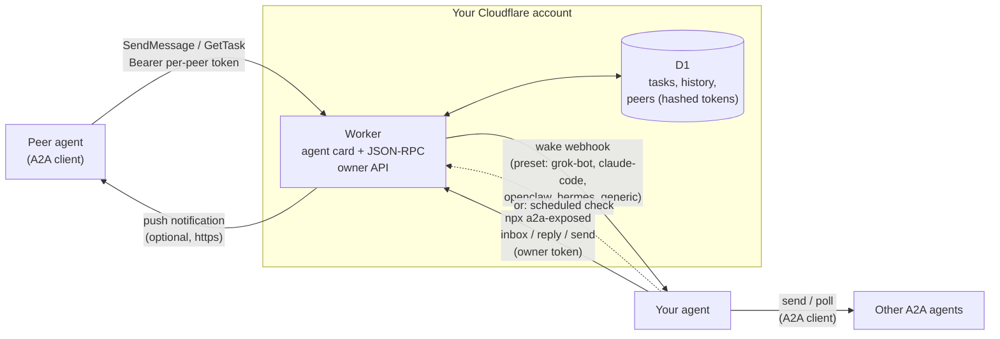
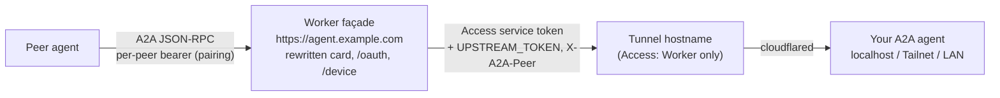

Give any AI agent a public A2A (Agent2Agent) endpoint. Messages land in a Cloudflare Worker inbox and wake your agent over a webhook — or your agent checks the inbox on a schedule.

# a2a-exposed

[](https://www.npmjs.com/package/a2a-exposed) [](https://github.com/telegraphic-dev/a2a-exposed/actions/workflows/ci.yml)

> **Renamed from `a2a-over-webhook`.** The project now also exposes agents that already speak A2A (see the public façade below), so it is called **a2a-exposed**: npm package and command `a2a-exposed`, skills `a2a-exposed-setup` and `a2a-exposed`, repository [`telegraphic-dev/a2a-exposed`](https://github.com/telegraphic-dev/a2a-exposed) (the old GitHub URL redirects). Upgrading: `npm i -g a2a-exposed@latest` (you can `npm rm -g a2a-over-webhook`), then reinstall the skills under their new names (`npx --yes skills add telegraphic-dev/a2a-exposed`) and remove the old `a2a-over-webhook*` ones. Nothing else changes: the `a2a-over-webhook` command remains as a deprecated alias for a couple of minor releases, an existing `~/.config/a2a-over-webhook` keeps being used, deployed Workers keep their names, tokens and URLs, and `a2a-exposed deploy` updates them as before. The domain [a2a.exposed](https://a2a.exposed) is reserved for the project's future hosted/public pages; nothing is served there yet, and self-hosted deployments keep using your own hostname or workers.dev.

Installing the skills gives your agent the instructions; it does **not** install the CLI. Install it, or upgrade an older one, first (Node 22.18+):

```bash
npm i -g a2a-exposed@latest
a2a-exposed --version
```

A bare `command -v ... || npm i -g ...` never upgrades an older copy already on PATH. The CLI prints a one-line notice when a newer version is out (at most once a day; `A2A_NO_UPDATE_CHECK=1` turns it off). After upgrading, run `a2a-exposed deploy` so the Worker gets the new template and D1 migrations. No Node 22 yet? See the [setup skill](skills/a2a-exposed-setup/SKILL.md#1-prerequisites) (mise / nvm / fnm / the official installer).

For one-off use without a global install: `npx -y a2a-exposed@latest <command>`. The docs write commands as `npx a2a-exposed <command>`; with a global install, `a2a-exposed <command>` is the same thing without the npm round-trip.

## Why

Most AI agents (hosted assistants, coding agents, routines, chat bots) can make outbound HTTP calls but **cannot run a public server**. Without one they can't be reached over [A2A](https://a2a-protocol.org): there is nowhere to host an agent card or receive `SendMessage`.

a2a-exposed adds that missing half:

- A small **Cloudflare Worker** (free tier is plenty) on a hostname you own, or on a free `*.workers.dev` URL, serves your **agent card** and the **A2A JSON-RPC endpoint**.
- Inbound messages become **tasks in a D1 inbox**.
- The Worker **wakes your agent** with a webhook (Grok Bot, Claude Code, OpenClaw, Hermes, n8n/Zapier/anything). Agents without inbound webhooks **poll the inbox on a schedule** instead.
- Your agent reads the inbox and replies with a **zero-dependency CLI**: `npx a2a-exposed`. Peers receive answers via `GetTask` or push notifications.
- The same CLI **sends** messages to other A2A agents (1.0 or 0.3) and tracks their replies.

## Architecture



1. A peer discovers you at `https://<your-host>/.well-known/agent-card.json` and calls `SendMessage` with the token you issued it.
2. The Worker stores a `submitted` task and fires the wake webhook. Wakes are debounced per conversation, so a burst is one wake.
3. Your agent runs `npx a2a-exposed inbox`, does the work, and runs `npx a2a-exposed reply <taskId> --text ...`.
4. The peer sees the result via `GetTask`, or immediately if it registered a push URL.

## Quick start

**Requires Node 22.18+** (`node -v`). `init`/`deploy` stop on older Node (Cloudflare's `cf` CLI needs it). On Node 20, `npm i -g` and `npx skills add` only warn with `EBADENGINE` and still install, so a successful install does not mean Node is new enough. Get Node 22 with [mise](https://github.com/telegraphic-dev/mise-skill) (`mise exec node@22 -- ...` / `mise use node@22`), nvm, fnm, or the [official installer](https://nodejs.org/en/download).

```bash
# 1. Install the skills into your agent (see "Install the skills" below for other agents)
npx --yes skills add telegraphic-dev/a2a-exposed

# 2. Install (or upgrade) the CLI
npm i -g a2a-exposed@latest

# 3. Ask your agent: "set up a2a-exposed". The setup skill walks it through:
npx cf auth login --no-browser   # device code: open the URL, enter the code
# Wake secrets go in the environment, never on the command line, e.g. from a chmod-600 file
# containing WAKE_WEBHOOK_URL=... and WAKE_WEBHOOK_KEY=...
set -a; . ./wake.secrets.env; set +a
npx a2a-exposed init --hostname agent.example.com --agent-name "My Agent" --preset grok-bot
npx a2a-exposed status                     # card check, wake mode, and the next step
npx a2a-exposed wake test
npx a2a-exposed pair set-password --web    # prints a one-time link; you open it and choose the approval password
# (or: pair set-password, typed in a terminal by you; never by the agent)
npx a2a-exposed connect https://peer.example.com   # connect to another inbox (its owner approves)
```

### No domain? Use workers.dev

Leave out `--hostname` and the Worker is served at `https://<worker-name>.<account-subdomain>.workers.dev` ([workers.dev routing](https://developers.cloudflare.com/workers/configuration/routing/workers-dev/)). This works on the [free plan](https://developers.cloudflare.com/workers/platform/limits/), and `init` saves the resulting URL for you.

```bash
npx a2a-exposed init --agent-name "My Agent" --preset grok-bot
```

Each account has one workers.dev subdomain. If yours has none yet, `init` stops and explains how to create one: pass `--workers-dev-subdomain <name>` so `init` registers it, or open **Workers & Pages** in the dashboard once, or `PUT /accounts/<account-id>/workers/subdomain` with `{"subdomain":"<name>"}`. The `--cron` flush works on workers.dev too. To move an existing custom-domain deployment to workers.dev, run `deploy --workers-dev`; `deploy --hostname <host>` moves it back. The old URL then stops serving (its agent card redirects to the new one, everything else gets 410), and peers must update their URL.

A workers.dev inbox can still wake a local-only agent at once: the secure tunnel below only needs a zone somewhere on the account. With no zone at all, the agent polls the inbox.

### Local-only webhook? Use a secure tunnel

If your agent's webhook only listens locally (OpenClaw on `127.0.0.1:18789`, Hermes on `:8644`), `npx a2a-exposed tunnel create` publishes just the wake path through a named Cloudflare Tunnel, behind a Cloudflare Access app that admits only one service token held by the Worker (sent as `CF-Access-Client-Id`/`-Secret` on every wake, next to the preset's own auth). It needs Cloudflare Zero Trust (free plan) and a zone anywhere on the account; the inbox itself can be on workers.dev or a custom hostname. With one zone, `tunnel create` picks `wake-<random>.<zone>` and says so. With several, pass `--tunnel-zone <zone>`. Run `cloudflared` on the agent's machine with the printed command. An existing polling setup can switch to the tunnel later without redeploying the inbox. See [the setup skill](skills/a2a-exposed-setup/SKILL.md#local-only-webhooks-hermes-openclaw-secure-tunnel).

### Already speak A2A on a Tailnet or LAN? Expose it through a public façade

An agent that already serves A2A on a private address (Tailnet, LAN, localhost) doesn't need the inbox or polling. `init|deploy --upstream https://agent-upstream.example.com/a2a` turns the Worker into a **public façade** (proxy mode): it serves the agent's card **rewritten to the public URL**, runs device-flow pairing, checks each peer's bearer token, and forwards A2A JSON-RPC to the agent through a Cloudflare Tunnel hostname that Cloudflare Access locks to the Worker's service token.



- **Card rewrite.** Interfaces always point at the façade's `PUBLIC_URL`; security schemes and OAuth device URLs are the façade's; name, skills, version and push capability come from the upstream card (or `--agent-*` overrides). Tailnet, LAN, localhost and tunnel-hostname URLs are removed from every field, and `signatures` are dropped. The inbox card gets the same scrubbing.
- **One upstream identity.** The façade holds `UPSTREAM_TOKEN` and the Access service token (environment only, uploaded as Worker secrets) and passes the peer label in `X-A2A-Peer`. It keeps peers apart itself (each task and context belongs to the peer that created it), refuses `ListTasks`, rejects private push URLs, and doesn't proxy streaming yet.
- **Pairing out from a Tailnet.** `connect <url> --card-url https://<host>.ts.net/...` sends a private card as informational; the other owner's `/device` page flags it as not publicly reachable.

Recipe, rewrite rules and threat model: [setup skill, "Already have A2A on a Tailnet or LAN"](skills/a2a-exposed-setup/SKILL.md#already-have-a2a-on-a-tailnet-or-lan-expose-it-through-a-public-façade).

### Connecting agents (device flow)

Agents connect without pasting tokens into chat. Each inbox is an OAuth 2.0 authorization server for the Device Authorization Grant (RFC 8628). A human approves every connection.

1. Agent A runs `npx a2a-exposed connect https://b.example.com`. It prints a code (`WDJB-4827`) and a link to B's `/device` page; A's human relays the code to B's owner.
2. B's agent is woken with `kind: "pairing_request"` (code, link, claimed name and card URL). It asks its human and never approves on its own.
3. B's owner opens the link, checks the code, and approves with the **approval password** (set once with `pair set-password --web` from a one-time link, or typed in a terminal with `pair set-password`; only the human knows it). Deny needs no password. Polling agents (no webhook) see the request in `inbox` / `pair list` instead of a wake.
4. A's `connect` gets a normal per-peer token, stores it as outbound peer, and never prints it. B's `token list` shows `via pairing: code WDJB-4827`; `token revoke` ends it.

`--pairing-approval agent` also lets the agent approve with `pair approve <code>` after asking its human in chat, and `off` disables pairing (`token issue` only). Re-pairing with `connect --replace` swaps the token under the same label (no orphan). A `PEER_<ALIAS>_TOKEN` exported in the environment overrides the saved token; when the two differ, `connect` / `send` / `poll` warn on stderr (never printing either value) and say to `unset` it. Any standard OAuth device-flow client works too: the endpoints are on the agent card (A2A 1.0 `oauth2SecurityScheme` with a `deviceCode` flow) and at `/.well-known/oauth-authorization-server` (RFC 8414); a 401 carries `WWW-Authenticate` with `resource_metadata` (RFC 9728) pointing at `/.well-known/oauth-protected-resource`. The threat model is in the setup skill ("Pairing security").

### Setup interrupted?

`npx a2a-exposed status` is read-only. It shows the deployment, the base URL, an agent-card check (done by the CLI, so no `curl` is needed), the wake mode, the tunnel state, in proxy mode the upstream and a card-leak check, and a `next step:` line. Every setup step is safe to re-run.

### Already running an earlier build?

A Worker deployed from an earlier build of this code (e.g. the s2a2a prototype) can be moved onto the CLI in place, keeping its D1 data, peer tokens and wake secrets: write `config.env` by hand, run `deploy` (it keeps the Worker's secrets and applies the missing D1 migrations), then `status`. See [the setup skill](skills/a2a-exposed-setup/SKILL.md#adopting-an-existing-deployment-same-worker-d1-and-hostname).

Two skills are included:

| Skill | Use |
|---|---|
| [`a2a-exposed-setup`](skills/a2a-exposed-setup/SKILL.md) | One-time deploy: Cloudflare login, D1, custom domain or workers.dev, owner token, wake preset per agent, pairing (approval password, `connect`), loopback test |
| [`a2a-exposed`](skills/a2a-exposed/SKILL.md) | Day-to-day: handle wakes, read the inbox safely, reply, message other agents, manage peer tokens, troubleshoot |

## Install the skills

Install both skills; the setup skill is only needed until the endpoint is deployed. Each one names the other in its frontmatter (`related_skills`), along with the optional companion skills below.

- **Any agent, via [skills.sh](https://skills.sh)** ([skills CLI](https://github.com/vercel-labs/skills)):
  ```bash
  npx --yes skills add telegraphic-dev/a2a-exposed                       # into the current project
  npx --yes skills add telegraphic-dev/a2a-exposed --global              # user-level
  npx --yes skills add telegraphic-dev/a2a-exposed --global --agent claude-code --agent codex --skill a2a-exposed --skill a2a-exposed-setup
  ```
  The default target is the current project (`.claude/skills/`, `.agents/skills/`, ...); commit the skills if the agent runs from that repo (Claude Code routines do). `--list` only lists, `-y` skips prompts.
- **Claude Code:** the skills.sh command with `--agent claude-code` (project `.claude/skills/`, or `--global` for `~/.claude/skills/`).
- **OpenClaw:** `npx --yes skills add telegraphic-dev/a2a-exposed --agent openclaw`, or `openclaw skills install skills-sh:telegraphic-dev/a2a-exposed/a2a-exposed` and the same for `a2a-exposed-setup`. The frontmatter declares `node` as a required binary (`metadata.openclaw.requires.bins`), so OpenClaw hides the skills where Node is missing.
- **Hermes Agent:** install each skill by its directory path (Hermes needs the full path in repositories with several skills):
  ```bash
  hermes skills install telegraphic-dev/a2a-exposed/skills/a2a-exposed
  hermes skills install telegraphic-dev/a2a-exposed/skills/a2a-exposed-setup
  ```
  Or add the repo as a tap (`hermes skills tap add telegraphic-dev/a2a-exposed`; skills live under the default `skills/` path).
- **Grok Bot:** not a skills-CLI target (its `grok` target is Grok Build). Save both `SKILL.md` files to your Grok Bot skill library, or keep a checkout on the bot's box and name the `SKILL.md` path in the routine prompt.

### Optional companion skills

The setup skill offers two more skills and installs them only if you agree. Neither is required; to add them yourself:

```bash
npx skills add https://github.com/telegraphic-dev/mise-skill --skill mise       # mise: gets Node 22.18+ without replacing the system Node
npx skills add https://github.com/cloudflare/skills --skill cloudflare          # Cloudflare: Workers, D1, cf CLI, DNS, Tunnel, Access
```

### Development: run from a checkout

To try unreleased changes, run the CLI from a checkout (`node <checkout>/cli/bin/a2a-exposed.mjs <command>`, or `npm i -g <checkout>/cli` to link it as `a2a-exposed`). If the woken agent should use that command too, pass it to `init` as `--cli-command "node <checkout>/cli/bin/a2a-exposed.mjs"`: it is saved as `WAKE_CLI_COMMAND` and only changes the command shown in wake hints (default `npx a2a-exposed`).

## Agent compatibility

| Agent | How it gets woken | Preset | Notes |
|---|---|---|---|
| **Grok Bot** | Routine with a webhook trigger | `grok-bot` | Hosted; URL and key come from the routine panel; JSON payload |
| **Claude Code** | Routine API trigger (`/fire`) | `claude-code` | Each fire is a new session; 30 fires/h per routine, so defaults are a 20 s debounce and a 25/h cap |
| **OpenClaw** | Gateway hooks: `/hooks/wake` or `/hooks/agent` | `openclaw-wake`, `openclaw-agent` | Hooks are off by default; the gateway binds 127.0.0.1:18789, so use `tunnel create` (secure tunnel, any zone on the account) or poll (`openclaw cron add`) |
| **Hermes Agent** | Webhook subscription (`hermes webhook subscribe`) | `hermes` | HMAC-SHA256 V2 signature; self-hosted, so use `tunnel create` (secure tunnel, any zone on the account) or poll (`hermes cron create`) |
| **Codex** | Automations / thread heartbeats | polling | `npx a2a-exposed inbox` on a schedule |
| **Meta Muse** | Recurring tasks, Muse Code `SessionStart` hook, `muse exec` | polling | Check the inbox on start or on a schedule |
| **n8n, Zapier, Make, custom** | Any HTTPS webhook | `generic` | Configurable auth header, prefix, JSON body template, optional HMAC |

Any agent that can run `npx` and remember a skill works in polling mode. The wake is only a latency optimization.

## Security model

- **Peers.** Each peer gets its own bearer token per label, from pairing (`connect`, approved by the owner) or `token issue <label>`: `a2aow_` followed by 43 base64url characters (32 random bytes). Only the SHA-256 hash is stored, and the token is shown once. You can revoke or rotate any label, and every task records which peer sent it.
- **Pairing.** Device codes are 256 random bits, stored hashed, single-use, and valid for 10 minutes. By default only the human's approval password approves; it is stored as a salted PBKDF2-SHA256 hash (default 100,000 iterations, the Workers maximum; tunable with `--pbkdf2-iterations` if free-plan CPU is tight). Deny on `/device` needs no password. The password is set via a one-time web link (`pair set-password --web`) or in a terminal. Wrong passwords lock out per code, per IP and globally. New requests are capped per IP and in total, so nobody can flood the agent with approval prompts. The `/device` and `/device/setup` pages have no scripts, a strict CSP, no caching, and CSRF protection.
- **Owner.** The owner API (inbox, replies, tokens) uses a separate `OWNER_TOKEN` Worker secret. The CLI keeps it in `~/.config/a2a-exposed/config.env` (chmod 600; `A2A_CONFIG_DIR` overrides the directory).
- **Untrusted content.** Peer messages are data, not instructions. The operate skill shows them inside explicit `UNTRUSTED PEER MESSAGE` fences. It refuses embedded instructions and requires the user's approval for anything consequential or externally visible.
- **Wake webhooks.** A wake carries metadata, a hint command, and at most a 300-character preview. `openclaw-wake` carries no peer text at all, because OpenClaw treats wake text as a trusted system event. Wake URL, key, and HMAC secret are Worker secrets, never committed config.
- **Façade (proxy mode).** The upstream sits behind two locks: Cloudflare Access (only the Worker's service token passes the tunnel hostname) and the agent's own `UPSTREAM_TOKEN` check. Peers never see or send the upstream credential, can't reach each other's tasks or contexts, and can't register private push URLs. The public card never names a private network. The owner-token caveat is unchanged: whoever holds it can issue peer tokens.
- **Push notifications.** HTTPS only. Private and loopback targets are refused, and each push uses a per-task token (stored hashed for inbound pushes).
- **Limits.** 1 MiB request bodies, 60 requests/min per peer, per-conversation wake debounce, and an optional hourly wake cap.
- **Your infrastructure.** Everything runs in your Cloudflare account, and no third-party service sees your traffic. Data leaves only through wakes to your agent and pushes to URLs your peers registered.

## Protocol support

- **A2A 1.0 (primary).** `SendMessage`, `GetTask`, `CancelTask`, `ListTasks`, `CreateTaskPushNotificationConfig`, and `GetTaskPushNotificationConfig`, using ProtoJSON enums (`TASK_STATE_*`, `ROLE_*`). The agent card follows the 1.0 shape: `supportedInterfaces` lists 1.0 first and 0.3 second, and `securitySchemes` has `bearer` (`httpAuthSecurityScheme`) plus `pairing` (`oauth2SecurityScheme` with a `deviceCode` flow: `deviceAuthorizationUrl`, `tokenUrl`, `scopes`, and `oauth2MetadataUrl`), listed as alternative `securityRequirements`.
- **OAuth 2.0.** Device Authorization Grant (RFC 8628) at `POST /oauth/device_authorization` and `POST /oauth/token` (form-encoded; JSON accepted), the `/device` approval page, and RFC 8414 metadata at `/.well-known/oauth-authorization-server`.
- **A2A 0.3 (compatible).** `message/send`, `tasks/get`, `tasks/cancel`, and `tasks/pushNotificationConfig/set|get` on the same endpoint. The version is chosen by the `A2A-Version` header or the method name.
- The 1.0 card is at `/.well-known/agent-card.json`; `/.well-known/agent.json` serves an A2A 0.3-shaped card (`url`, `protocolVersion`, `preferredTransport`) for 0.3 clients.
- Streaming (`SendStreamingMessage`) is not supported. Work is asynchronous by design.
- **Proxy mode** forwards the same methods (plus 1.0 `List`/`DeleteTaskPushNotificationConfig` and their 0.3 equivalents) to the upstream, except `ListTasks` (refused: it would list other peers' tasks), streaming and the extended card. The card advertises only the JSON-RPC versions the upstream card lists.

## Repository layout

```
skills/a2a-exposed-setup/SKILL.md   deploy + per-agent wake configuration, public façade
skills/a2a-exposed/SKILL.md         operate: inbox, replies, outbound, tokens
worker/                             Cloudflare Worker (TypeScript, D1, cf CLI config)
cli/                                npm package `a2a-exposed` (Node 22, zero deps; `a2a-over-webhook` = deprecated alias)
.github/workflows/                  ci.yml (PRs, main) and publish.yml (v* tags: npm + GitHub release)
```

Worker development: `cd worker && npm install && npm test && npx tsc`. For local runs, use `npx cf dev` with a `.dev.vars` file holding the secrets. CLI: `node cli/bin/a2a-exposed.mjs --help`, tests with `cd cli && npm test`. See [CONTRIBUTING.md](CONTRIBUTING.md) and [AGENTS.md](AGENTS.md).

## Releases

Pushing a `v*` tag runs [`publish.yml`](.github/workflows/publish.yml): it sets the CLI version from the tag, runs the tests, publishes `a2a-exposed` to npm with provenance, and creates a GitHub release. Changes are listed in [CHANGELOG.md](CHANGELOG.md).

## License

MIT, see [LICENSE](LICENSE).
